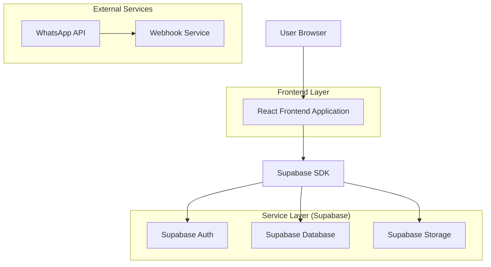
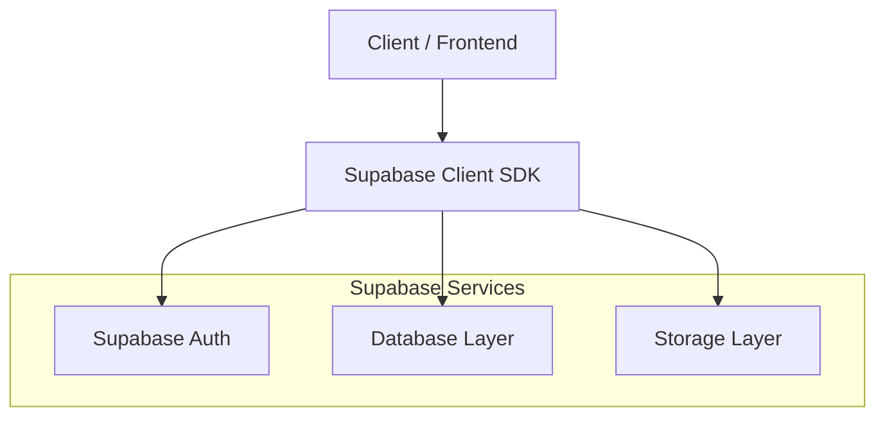
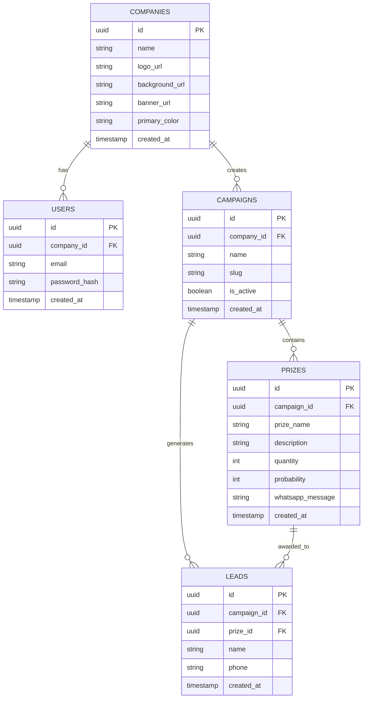

## 1. Architecture design



## 2. Technology Description
- Frontend: React@18 + tailwindcss@3 + vite
- Initialization Tool: vite-init
- Backend: Supabase (BaaS)
- Database: PostgreSQL (via Supabase)
- Storage: Supabase Storage (for images)
- Authentication: Supabase Auth

## 3. Route definitions
| Route | Purpose |
|-------|---------|
| /admin/login | Admin authentication page |
| /admin/dashboard | Main dashboard with analytics |
| /admin/settings | Company branding settings |
| /admin/campaigns | Campaign management CRUD |
| /admin/campaigns/new | Create new campaign |
| /admin/campaigns/:id/prizes | Prize configuration |
| /admin/leads | Leads management and export |
| /:slug | Public campaign page with registration |
| /:slug/wheel | Interactive wheel page |
| /:slug/result | Prize result page |

## 4. API definitions

### 4.1 Authentication APIs
```
POST /auth/v1/token
```

Request:
| Param Name| Param Type  | isRequired  | Description |
|-----------|-------------|-------------|-------------|
| email     | string      | true        | Admin email |
| password  | string      | true        | Admin password |

### 4.2 Campaign APIs
```
GET /rest/v1/campaigns
POST /rest/v1/campaigns
PATCH /rest/v1/campaigns/:id
DELETE /rest/v1/campaigns/:id
```

### 4.3 Prize APIs
```
GET /rest/v1/prizes?campaign_id=eq.{id}
POST /rest/v1/prizes
PATCH /rest/v1/prizes/:id
```

### 4.4 Lead APIs
```
POST /rest/v1/leads
GET /rest/v1/leads?campaign_id=eq.{id}
```

## 5. Server architecture diagram



## 6. Data model

### 6.1 Data model definition


### 6.2 Data Definition Language

**Companies Table**
```sql
CREATE TABLE companies (
    id UUID PRIMARY KEY DEFAULT gen_random_uuid(),
    name VARCHAR(255) NOT NULL,
    logo_url TEXT,
    background_url TEXT,
    banner_url TEXT,
    primary_color VARCHAR(7) DEFAULT '#8A2BE2',
    created_at TIMESTAMP WITH TIME ZONE DEFAULT NOW()
);
```

**Users Table**
```sql
CREATE TABLE users (
    id UUID PRIMARY KEY DEFAULT gen_random_uuid(),
    company_id UUID REFERENCES companies(id) ON DELETE CASCADE,
    email VARCHAR(255) UNIQUE NOT NULL,
    password_hash VARCHAR(255) NOT NULL,
    created_at TIMESTAMP WITH TIME ZONE DEFAULT NOW()
);
```

**Campaigns Table**
```sql
CREATE TABLE campaigns (
    id UUID PRIMARY KEY DEFAULT gen_random_uuid(),
    company_id UUID REFERENCES companies(id) ON DELETE CASCADE,
    name VARCHAR(255) NOT NULL,
    slug VARCHAR(255) UNIQUE NOT NULL,
    is_active BOOLEAN DEFAULT true,
    created_at TIMESTAMP WITH TIME ZONE DEFAULT NOW()
);

CREATE INDEX idx_campaigns_company_id ON campaigns(company_id);
CREATE INDEX idx_campaigns_slug ON campaigns(slug);
```

**Prizes Table**
```sql
CREATE TABLE prizes (
    id UUID PRIMARY KEY DEFAULT gen_random_uuid(),
    campaign_id UUID REFERENCES campaigns(id) ON DELETE CASCADE,
    prize_name VARCHAR(255) NOT NULL,
    description TEXT,
    quantity INTEGER NOT NULL DEFAULT 0,
    probability INTEGER NOT NULL CHECK (probability >= 0 AND probability <= 100),
    whatsapp_message TEXT NOT NULL,
    created_at TIMESTAMP WITH TIME ZONE DEFAULT NOW()
);

CREATE INDEX idx_prizes_campaign_id ON prizes(campaign_id);
```

**Leads Table**
```sql
CREATE TABLE leads (
    id UUID PRIMARY KEY DEFAULT gen_random_uuid(),
    campaign_id UUID REFERENCES campaigns(id) ON DELETE CASCADE,
    prize_id UUID REFERENCES prizes(id),
    name VARCHAR(100) NOT NULL,
    phone VARCHAR(20) NOT NULL,
    created_at TIMESTAMP WITH TIME ZONE DEFAULT NOW()
);

CREATE INDEX idx_leads_campaign_id ON leads(campaign_id);
CREATE INDEX idx_leads_created_at ON leads(created_at DESC);
```

**Row Level Security (RLS) Policies**
```sql
-- Enable RLS
ALTER TABLE companies ENABLE ROW LEVEL SECURITY;
ALTER TABLE campaigns ENABLE ROW LEVEL SECURITY;
ALTER TABLE prizes ENABLE ROW LEVEL SECURITY;
ALTER TABLE leads ENABLE ROW LEVEL SECURITY;

-- Grant permissions
GRANT SELECT ON companies TO anon;
GRANT ALL ON companies TO authenticated;
GRANT SELECT ON campaigns TO anon;
GRANT ALL ON campaigns TO authenticated;
GRANT SELECT ON prizes TO anon;
GRANT ALL ON prizes TO authenticated;
GRANT SELECT ON leads TO anon;
GRANT ALL ON leads TO authenticated;

-- Campaign visibility policy
CREATE POLICY "Campaigns are viewable by everyone" ON campaigns
    FOR SELECT USING (is_active = true);

-- Leads insertion policy
CREATE POLICY "Anyone can create leads" ON leads
    FOR INSERT WITH CHECK (true);
```