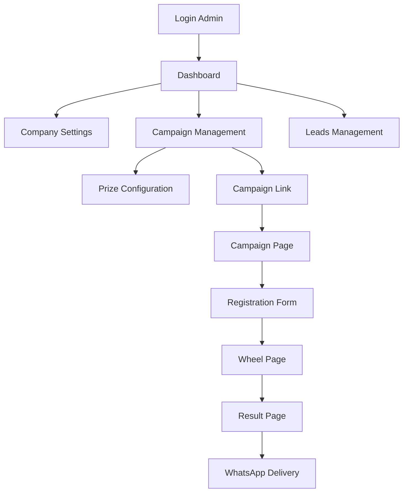

## 1. Product Overview
Sistema de Roleta Premiada SaaS para marketing de engajamento, permitindo que lojistas criem campanhas personalizadas de roleta da sorte. O cliente final acessa por link, faz microcadastro e recebe prêmios via WhatsApp, enquanto o lojista gerencia tudo pelo painel administrativo.

## 2. Core Features

### 2.1 User Roles
| Role | Registration Method | Core Permissions |
|------|---------------------|------------------|
| Lojista | Email registration via admin panel | Create/manage campaigns, customize branding, view leads |
| Cliente Final | Micro-registration (name + phone) on campaign page | Spin wheel, receive prizes via WhatsApp |

### 2.2 Feature Module
O sistema consiste nos seguintes módulos principais:
1. **Painel Administrativo**: dashboard, gestão de campanhas, configurações visuais, gestão de prêmios e leads
2. **Página da Roleta**: cadastro simplificado, roleta animada, resultado e envio de prêmio

### 2.3 Page Details
| Page Name | Module Name | Feature description |
|-----------|-------------|---------------------|
| Login | Authentication | Email/password login with Supabase Auth, password reset |
| Dashboard | Analytics | Display total leads, active/inactive campaigns, performance reports |
| Company Settings | Branding | Upload logo, background image, banner, set primary color (violet default) |
| Campaign Management | CRUD Operations | Create campaign, activate/deactivate, set call-to-action phrase, auto-generate unique slug |
| Prize Configuration | Prize Management | Add prizes with quantity and probability (%), types: discount coupon, gift, cashback, free shipping, physical prize, others, configure WhatsApp delivery message |
| Leads Management | Lead Tracking | List participants with name/phone/date/prize, export CSV |
| Campaign Page | Customer Registration | Simple form: name, phone, LGPD consent checkbox |
| Wheel Page | Interactive Wheel | Display merchant logo, custom background, animated wheel (violet/black), sound effects, "Spin Now" button |
| Result Page | Prize Display | Show prize won, WhatsApp delivery button, automatic API integration |

## 3. Core Process
### Fluxo do Lojista
1. Acessa painel administrativo e faz login
2. Configura identidade visual da empresa
3. Cria nova campanha com slug único
4. Cadastra prêmios com probabilidades
5. Copia link da campanha e compartilha
6. Acompanha leads e estatísticas no dashboard

### Fluxo do Cliente
1. Clica no link da campanha
2. Preenche cadastro simplificado (nome + telefone)
3. Gira a roleta animada
4. Visualiza resultado do prêmio
5. Recebe prêmio automaticamente via WhatsApp

## 4. User Interface Design

### 4.1 Design Style
- **Cores Primárias**: Violeta (#8A2BE2) e Preto (#000)
- **Cores Secundárias**: Cinza suave para contraste
- **Estilo de Botões**: Arredondados, modernos
- **Tipografia**: Inter ou Poppins, moderna e legível
- **Layout**: Card-based, navegação superior
- **Animações**: Suaves na roleta, transições fluidas
- **Ícones**: Estilo moderno, minimalista

### 4.2 Page Design Overview
| Page Name | Module Name | UI Elements |
|-------------|---------------|---------------|
| Dashboard | Analytics | Cards com métricas, gráficos simples, cores violeta/preto, layout grid |
| Campaign Management | Forms | Inputs arredondados, botões violeta, tabelas limpas, badges de status |
| Wheel Page | Interactive | Roleta centralizada, fundo customizável, botão "Girar Agora" destacado, efeitos de animação |
| Result Page | Prize Display | Card central com prêmio, botão WhatsApp verde, animação de celebração |

### 4.3 Responsiveness
- **Desktop-first**: Otimizado para desktop, adaptável para mobile
- **PWA**: Instalável em desktop e mobile
- **Touch optimization**: Interface adaptada para interação tátil
- **Dark mode**: Suporte automático baseado no navegador ou manual